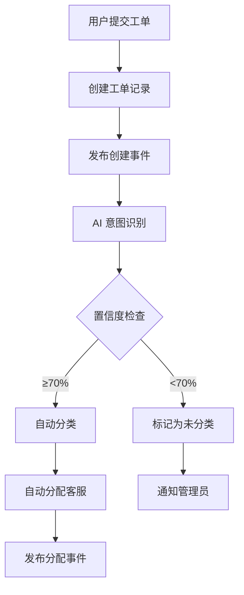
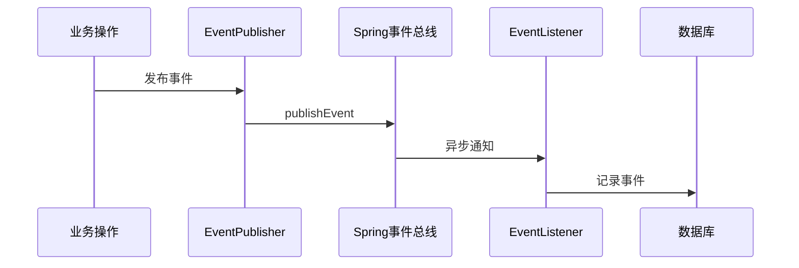

# 智能客服工单管理与溯源系统

## 项目简介

这是一个基于 Spring Boot 3.x 和 Vue 3 的智能客服工单管理系统，集成了 AI 意图识别、自动分类、智能分配、全流程事件溯源等功能。

## 核心功能

### 1. 智能工单创建与分类
- 用户提交工单后，AI 自动识别意图并分类
- 高置信度（≥70%）：自动分类并分配客服
- 低置信度（<70%）：标记为"未分类"，通知管理员手动处理

### 2. 工单生命周期管理
- **状态流转**：OPEN → UNCLASSIFIED/PENDING → CLOSED
- **客服操作**：接收、处理、回复、升级、关闭工单
- **管理员操作**：手动分类、查看统计数据

### 3. 事件驱动架构（EDA）
- 所有工单操作自动记录事件
- 支持全流程溯源和审计
- 异步事件处理，不阻塞主业务流程

### 4. AI 意图识别（Mock 实现）
- 基于知识库的关键词匹配
- 规则引擎分类（技术支持、账户问题、产品咨询、账单问题等）
- 返回置信度和推理过程

## 技术架构

### 后端技术栈
- **框架**：Spring Boot 3.5.7
- **Java 版本**：Java 21
- **数据库**：MySQL 8.0
- **ORM**：MyBatis 3.0.5
- **工具库**：Lombok

### 系统架构
```
Controller 层（API 接口）
    ↓
Service 层（业务逻辑）
    ├── WorkflowService（工单工作流）
    ├── AIService（AI 意图识别）
    └── EventPublisher（事件发布）
    ↓
Mapper 层（数据访问）
    ↓
MySQL 数据库
```

### 事件驱动架构
```
业务操作 → 发布事件 → EventPublisher
    ↓
ApplicationEventPublisher
    ↓
TicketEventListener（异步）→ 记录到 Event 表
```

## 快速开始

### 1. 环境要求
- JDK 21+
- Maven 3.8+
- MySQL 8.0+
- Node.js 16+（前端开发）

### 2. 数据库初始化

```bash
# 创建数据库并执行初始化脚本
mysql -u root -p < src/main/resources/schema.sql
```

### 3. 配置数据库连接

编辑 `src/main/resources/application.yml`：

```yaml
spring:
  datasource:
    url: jdbc:mysql://localhost:3306/ticket_system
    username: root
    password: your_password
```

### 4. 启动后端服务

```bash
# 方式1：使用 Maven
mvn spring-boot:run

# 方式2：使用 IDE
直接运行 SoftWareTestApplication.main()

# 方式3：打包后运行
mvn clean package
java -jar target/softWareTest-0.0.1-SNAPSHOT.jar
```

启动成功后访问：http://localhost:8080

## API 接口文档

### 工单管理 API

#### 1. 创建工单
```http
POST /api/tickets
Content-Type: application/json

{
  "title": "无法登录账户",
  "description": "我尝试多次登录都失败了",
  "priority": 2,
  "creatorId": 1
}
```

#### 2. 获取工单详情
```http
GET /api/tickets/{id}
```

#### 3. 获取所有工单
```http
GET /api/tickets
```

#### 4. 根据状态获取工单
```http
GET /api/tickets/status/{status}
```

#### 5. 关闭工单
```http
PUT /api/tickets/{id}/close?operatorId=1&operatorType=CS
```

### 管理员 API

#### 1. 手动分类工单
```http
PUT /api/admin/tickets/{id}/classify
Content-Type: application/json

{
  "ticketId": 1,
  "category": "技术支持",
  "adminId": 1
}
```

#### 2. 获取未分类工单
```http
GET /api/admin/tickets/unclassified
```

### 客服 API

#### 1. 获取分配的工单
```http
GET /api/cs/{csId}/tickets
```

#### 2. 处理工单
```http
PUT /api/cs/tickets/{id}/handle?csId=1&note=正在处理
```

### 事件溯源 API

#### 1. 获取工单事件历史
```http
GET /api/events/ticket/{ticketId}
```

#### 2. 获取最近事件
```http
GET /api/events/recent?limit=50
```

## 数据库设计

### 核心表结构

1. **user** - 用户表
2. **customer_service** - 客服表
3. **admin** - 管理员表
4. **ticket** - 工单表
5. **session** - 会话表
6. **event** - 事件表（溯源）
7. **kb_entry** - 知识库表

### ER 关系
- User 1:N Ticket（一个用户可创建多个工单）
- CustomerService 1:N Ticket（一个客服可处理多个工单）
- Ticket 1:N Event（一个工单有多个事件记录）
- Ticket 1:1 Session（一个工单对应一个会话）

## 项目结构

```
src/main/java/com/softwaretest/
├── constant/          # 常量定义
├── controller/        # API 控制器
├── dto/              # 数据传输对象
├── enums/            # 枚举类
├── event/            # 事件驱动相关
├── mapper/           # MyBatis 数据访问层
├── pojo/             # 实体类
├── service/          # 业务逻辑层
└── vo/               # 视图对象

src/main/resources/
├── application.yml   # 应用配置
└── schema.sql       # 数据库初始化脚本
```

## 工作流程说明

### 智能工单创建流程



### 事件溯源流程



## 测试数据

系统启动后会自动创建测试数据：
- 3 个测试用户
- 4 个客服（不同专长领域）
- 2 个管理员
- 6 条知识库条目
- 3 个示例工单

## 开发计划

- [x] 后端核心功能实现
- [x] 事件驱动架构
- [x] AI 意图识别（Mock）
- [x] RESTful API 设计
- [ ] Vue 3 前端界面
- [ ] WebSocket 实时通知
- [ ] 统计报表功能
- [ ] Docker 部署支持

## 许可证

MIT License

## 联系方式

如有问题，请提交 Issue 或 Pull Request。
